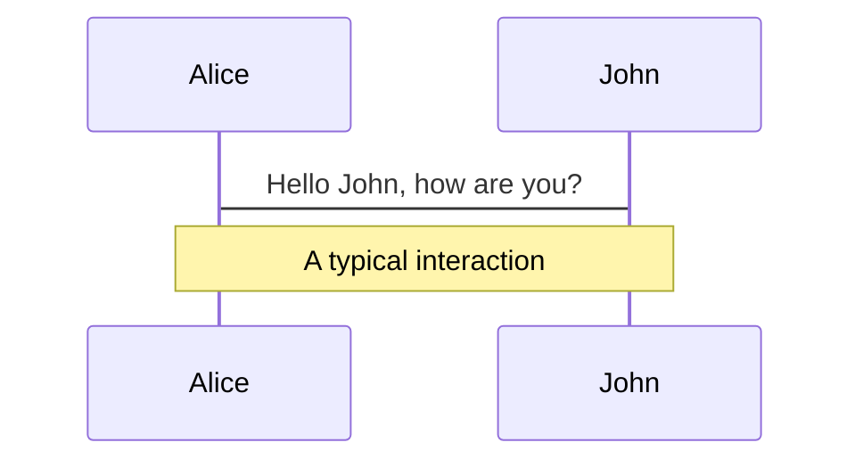
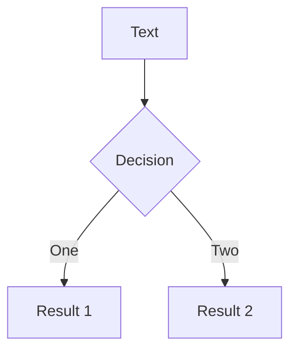
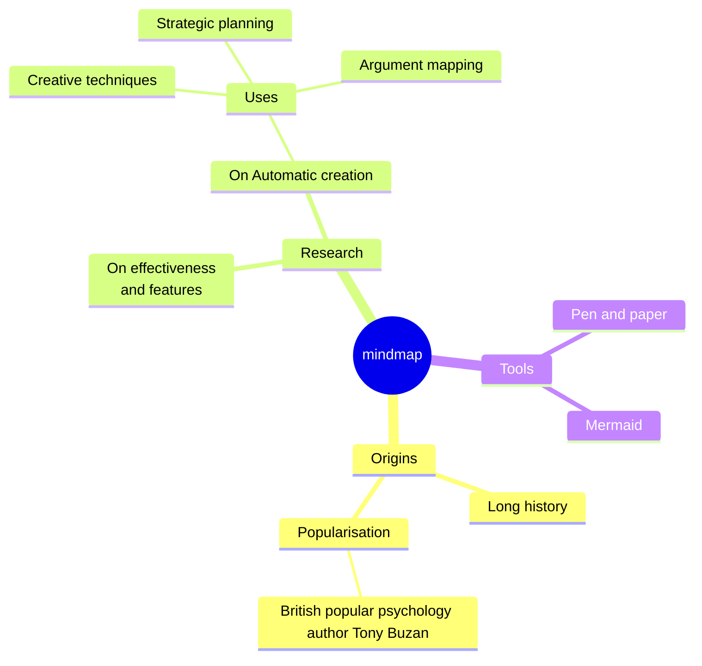
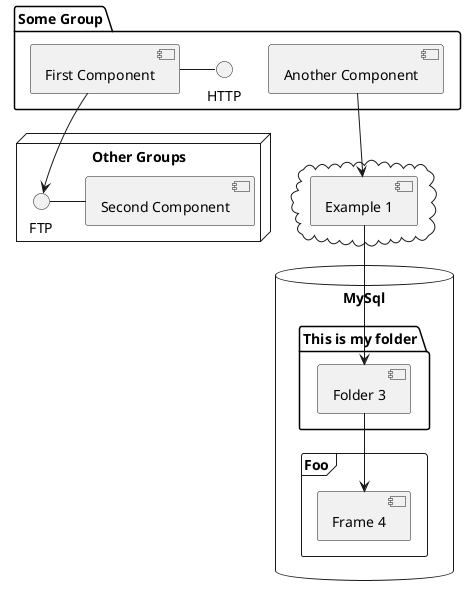

---
# try also 'default' to start simple
theme: dracula
# random image from a curated Unsplash collection by Anthony
# like them? see https://unsplash.com/collections/94734566/slidev
# some information about your slides, markdown enabled
title: Introduction to Terraform
# apply any unocss classes to the current slide
class: text-center
# https://sli.dev/custom/highlighters.html
highlighter: shiki
# https://sli.dev/guide/drawing
drawings:
  persist: false
# slide transition: https://sli.dev/guide/animations#slide-transitions
transition: slide-left
# enable MDC Syntax: https://sli.dev/guide/syntax#mdc-syntax
mdc: true
---

# Introduction to Terraform

## SE Community 2024
by
### Teerapat Prommarak


<!--
The last comment block of each slide will be treated as slide notes. It will be visible and editable in Presenter Mode along with the slide. [Read more in the docs](https://sli.dev/guide/syntax.html#notes)
-->

---
transition: fade-out
---

# What is Infrastructure as Code?

- Infrastructure as Code (IaC) is the practice of managing and provisioning computing infrastructure through machine-readable definition files, rather than physical hardware configuration or interactive configuration tools.

- With IaC, infrastructure is defined in code, allowing for automated provisioning, configuration, and management of infrastructure resources.

- IaC enables consistency, scalability, and repeatability in infrastructure deployment and management processes.

---
layout: image-right
image: https://cover.sli.dev
---

# Overview of Terraform

- Terraform is an open-source infrastructure as code software tool created by HashiCorp.
  
- It enables users to define and provision infrastructure using a high-level configuration language known as HashiCorp Configuration Language (HCL).

- Terraform allows for the management of infrastructure across various cloud providers (such as AWS, Azure, Google Cloud) as well as on-premises environments.

---
transition: fade-out
---

# Terraform Basics

- **Declarative vs. Imperative Approach**: Terraform follows a declarative approach, where you define the desired state of your infrastructure, rather than specifying the exact steps to achieve it.

- **Terraform Configuration Language (HCL)**: HCL is a simple, human-readable language used to define Terraform configurations. It allows you to describe infrastructure components and their relationships.

- **Infrastructure Management**: Terraform manages infrastructure resources through the use of providers and resources. Providers are responsible for managing the lifecycle of resources provided by a specific cloud or service.

---
transition: fade-out
---

# Terraform Architecture

- **Components**: Terraform architecture consists of several components, including providers, resources, state files, and modules. Providers are responsible for interacting with APIs of various cloud providers.

- **Provider Plugins**: Terraform uses provider plugins to interface with different cloud providers. These plugins abstract the underlying API calls and provide a consistent interface for managing resources.

- **State Management**: Terraform maintains a state file that records the current state of your infrastructure. This state file is used to track the relationship between your configuration and the real-world infrastructure.

---
level: 2
---

# Getting Started with Terraform

- **Installation and Setup**: Install Terraform CLI, initialize a new project with `terraform init`.

- **Writing Your First Configuration**: Create a `.tf` file, declare provider and resources.

- **Common Commands**: Use `terraform plan` to preview changes, `terraform apply` to apply changes, and `terraform destroy` to remove resources.

---

# Terraform Workflow

- **Planning (`terraform plan`)**: Generate an execution plan showing what Terraform will do when you apply your configuration. It helps you understand the changes that Terraform will make to your infrastructure.

- **Applying Changes (`terraform apply`)**: Apply the changes described in the Terraform configuration to your infrastructure. Terraform will create, update, or delete resources as necessary to match the desired state.

- **Destroying Resources (`terraform destroy`)**: Destroy the resources defined in your Terraform configuration. Use with caution as it permanently deletes infrastructure resources.

---
class: px-20
---

# Themes

Slidev comes with powerful theming support. Themes can provide styles, layouts, components, or even configurations for tools. Switching between themes by just **one edit** in your frontmatter:

<div grid="~ cols-2 gap-2" m="t-2">

```yaml
---
theme: default
---
```

```yaml
---
theme: seriph
---
```


</div>

Read more about [How to use a theme](https://sli.dev/themes/use.html) and
check out the [Awesome Themes Gallery](https://sli.dev/themes/gallery.html).

---

# Clicks Animations

You can add `v-click` to elements to add a click animation.

<div v-click>

This shows up when you click the slide:

```html
<div v-click>This shows up when you click the slide.</div>
```

</div>

<br>

<v-click>

The <span v-mark.red="3"><code>v-mark</code> directive</span>
also allows you to add
<span v-mark.circle.orange="4">inline marks</span>
, powered by [Rough Notation](https://roughnotation.com/):

```html
<span v-mark.underline.orange>inline markers</span>
```

</v-click>

<div mt-20 v-click>

[Learn More](https://sli.dev/guide/animations#click-animations)

</div>

---

# Motions

Motion animations are powered by [@vueuse/motion](https://motion.vueuse.org/), triggered by `v-motion` directive.

```html
<div
  v-motion
  :initial="{ x: -80 }"
  :enter="{ x: 0 }"
  :click-3="{ x: 80 }"
  :leave="{ x: 1000 }"
>
  Slidev
</div>
```

<div class="w-60 relative">
  <div class="relative w-40 h-40">
    
    
    
  </div>

  <div
    class="text-5xl absolute top-14 left-40 text-[#2B90B6] -z-1"
    v-motion
    :initial="{ x: -80, opacity: 0}"
    :enter="{ x: 0, opacity: 1, transition: { delay: 2000, duration: 1000 } }">
    Slidev
  </div>
</div>

<!-- vue script setup scripts can be directly used in markdown, and will only affects current page -->
<script setup lang="ts">
const final = {
  x: 0,
  y: 0,
  rotate: 0,
  scale: 1,
  transition: {
    type: 'spring',
    damping: 10,
    stiffness: 20,
    mass: 2
  }
}
</script>

<div
  v-motion
  :initial="{ x:35, y: 30, opacity: 0}"
  :enter="{ y: 0, opacity: 1, transition: { delay: 3500 } }">

[Learn More](https://sli.dev/guide/animations.html#motion)

</div>

---

# LaTeX

LaTeX is supported out-of-box powered by [KaTeX](https://katex.org/).

<br>

Inline $\sqrt{3x-1}+(1+x)^2$

Block
$$ {1|3|all}
\begin{array}{c}

\nabla \times \vec{\mathbf{B}} -\, \frac1c\, \frac{\partial\vec{\mathbf{E}}}{\partial t} &
= \frac{4\pi}{c}\vec{\mathbf{j}}    \nabla \cdot \vec{\mathbf{E}} & = 4 \pi \rho \\

\nabla \times \vec{\mathbf{E}}\, +\, \frac1c\, \frac{\partial\vec{\mathbf{B}}}{\partial t} & = \vec{\mathbf{0}} \\

\nabla \cdot \vec{\mathbf{B}} & = 0

\end{array}
$$

<br>

[Learn more](https://sli.dev/guide/syntax#latex)

---

# Diagrams

You can create diagrams / graphs from textual descriptions, directly in your Markdown.

<div class="grid grid-cols-4 gap-5 pt-4 -mb-6">









</div>

[Learn More](https://sli.dev/guide/syntax.html#diagrams)

---
foo: bar
dragPos:
  square: 691,33,167,_,-16
---

# Draggable Elements

Double-click on the draggable elements to edit their positions.

<br>

###### Directive Usage

```md

```

<br>

###### Component Usage

```md
<v-drag text-3xl>
  <carbon:arrow-up />
  Use the `v-drag` component to have a draggable container!
</v-drag>
```

<v-drag pos="671,205,253,_,-15">
  <div text-center text-3xl border border-main rounded>
    Double-click me!
  </div>
</v-drag>


---
src: ./pages/multiple-entries.md
hide: false
---

---

# Monaco Editor

Slidev provides built-in Monaco Editor support.

Add `{monaco}` to the code block to turn it into an editor:

```ts {monaco}
import { ref } from 'vue'
import { emptyArray } from './external'

const arr = ref(emptyArray(10))
```

Use `{monaco-run}` to create an editor that can execute the code directly in the slide:

```ts {monaco-run}
import { version } from 'vue'
import { emptyArray, sayHello } from './external'

sayHello()
console.log(`vue ${version}`)
console.log(emptyArray<number>(10).reduce(fib => [...fib, fib.at(-1)! + fib.at(-2)!], [1, 1]))
```

---
layout: center
class: text-center
---

# Learn More

[Documentations](https://sli.dev) · [GitHub](https://github.com/slidevjs/slidev) · [Showcases](https://sli.dev/showcases.html)
